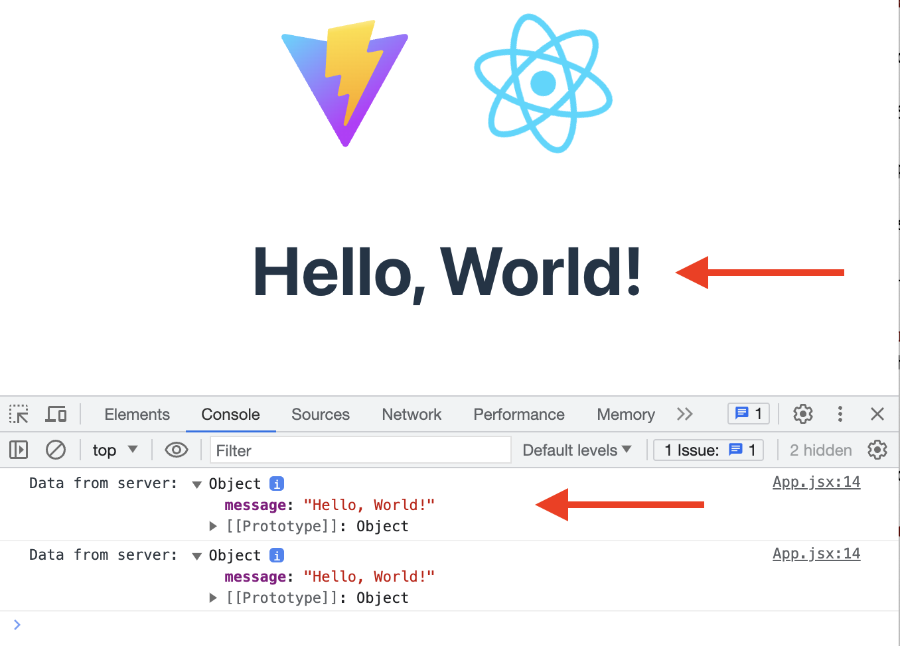

# Diet Hacks

A full stack React project for users who want to find and post diet hacks and tips.

## Table of Contents

- [Technologies Used](#technologies-used)
- [Live Demo](#live-demo)
- [Features](#features)
- [Preview](#preview)
- [Installation](#installation)
- [Challenges Encountered](#challenges-encountered)

## Technologies Used

- PostgreSQL
- Express
- React
- Node.js
- TypeScript
- AWS

## Features

- Users can register and login
- Users can create posts
- Users can upvote or downvote posts
- Users can comment on posts
- Users can filter posts by categories

## Preview


## Installation

1. Clone the repository:
    ```bash
    git clone https://github.com/your-username/your-repo-name.git
    ```
2. Navigate to the project directory:
    ```bash
    cd your-repo-name
3. Install all dependencies with `npm install`.

#### Create the database

If your project will be using a database, create it now.

1. Start PostgreSQL
   ```sh
   sudo service postgresql start
   ```
1. Create database (replace `name-of-database` with a name of your choosing, such as the name of your app)
   ```sh
   createdb name-of-database
   ```
1. In the `server/.env` file, in the `DATABASE_URL` value, replace `changeMe` with the name of your database, from the last step
1. While you are editing `server/.env`, also change the value of `TOKEN_SECRET` to a custom value, without spaces.
1. Make the same changes to `server/.env.example`.

If your project will _not_ be using a database, edit `package.json` to remove the `dev:db` script.

#### Start the development servers

1. Start all the development servers with the `"dev"` script:
   ```sh
   npm run dev
   ```
1. Later, when you wish to stop the development servers, type `Ctrl-C` in the terminal where the servers are running.

#### Verify the client

1. A React app has already been created for you.
1. Take a minute to look over the code in `client/src/App.tsx` to get an idea of what it is doing.
1. Go to the app in your browser. You should see the message from the server below the React logo, and in the browser console.
   
1. If you see the message from the server in your browser you are good to go, your client and server are communicating.

#### Set up the database

1. In your browser navigate to the site you used for your database design.
1. Export your database as PostgreSQL, this should generate the SQL code for creating your database tables.
   - Reach out to an instructor if you have any issues with this step
1. Copy the generated SQL code and paste it into `database/schema.sql` below the preexisting sql code in the file. The end result should look something like: _(You will likely have more tables)_

   ```SQL
   set client_min_messages to warning;

   -- DANGER: this is NOT how to do it in the real world.
   -- `drop schema` INSTANTLY ERASES EVERYTHING.
   drop schema "public" cascade;

   create schema "public";

   create table "todos" (
       "todoId"      serial PRIMARY KEY,
       "task"        text not null,
       "isCompleted" boolean not null,
       "createdAt"   timestamptz not null DEFAULT now(),
       "updatedAt"   timestamptz not null DEFAULT now()
   );
   ```

1. In a separate terminal, run `npm run db:import` to create your tables
1. Use `psql` to verify your tables were created successfully (see [LFZ Database Guide](https://lms.learningfuze.com/code-guides/Learning-Fuze/curriculum/database) for tips). Your database and tables should be listed; if not, stop here and reach out to an instructor for help
1. At this point your database is setup and you are good to start using it. However there is no data in your database, which isn't necessarily a bad thing, but if you want some starting data in your database you need to add insert statements into the `database/data.sql` file. You can add whatever starting data you need/want. Here is an example:
   ```SQL
   insert into "todos" ("task", "isCompleted")
   values
       ('Learn to code', false),
       ('Build projects', false),
       ('Get a job', false);
   ```
1. After any changes to `database/schema.sql` or `database/data.sql` re-run the `npm run db:import` command to update your database. Use `psql` to verify your changes were successfully applied.

### Available `npm` commands explained

Below is an explanation of all included `npm` commands in the root `package.json`. Several are only used for deployment purposes and should not be necessary for development.

1. `start`
   - The `start` script starts the Node server in `production` mode, without any file watchers.
1. `build`
   - The `build` script executes `npm run build` in the context of the `client` folder. This builds your React app for production. This is used during deployment, and not commonly needed during development.
1. `db:import`
   - The `db:import` script executes `database/import.sh`, which executes the `database/schema.sql` and `database/data.sql` files to build and populate your database.
1. `dev`
   - Starts all the development servers.
1. `lint`
   - Runs ESLint against all the client and server code.
1. Not directly used by developer
   1. `install:*`
   - These scripts install dependencies in the `client` and `server` folders, and copy `.env.example` to `.env` if it doesn't already exist.
   1. `dev:*`
   - These scripts start the individual development servers.
   1. `lint:*`
   - These scripts run lint in the client and server directories.
   1. `postinstall`
      - The `postinstall` script is automatically run when you run `npm install`. It is executed after the dependencies are installed. Specifically for this project the `postinstall` script is used to install the `client` and `server` dependencies.
   1. `prepare`
      - The `prepare` script is similar to `postinstall` — it is executed before `install`. Specifically for this project it is used to install `husky`.
   1. `deploy`
      - The `deploy` script is used to deploy the project by pushing the `main` branch to the `pub` branch, which triggers the GitHub Action that deploys the project.
     
## Challenges Encountered

1. When testing my POST route endpoint for comments with a postId, I purposely used a non-existent postId, which resulted in an error: "insert or update on table \"comments\" violates foreign key constraint \"comments_postId_fkey\"." I had to assert the error as a DatabaseError in my catch block and then pass a new ClientError using `next` to trigger the error middleware.

2. I needed to conditionally render the sidebar in desktop mode but not on mobile. I created a `useEffect` hook with a window resize event listener that sets the `setIsMobile` function to true if the window size is less than or equal to 768px. There was a bug where, if I refreshed the browser while in mobile view, React would still display the sidebar. The problem was that my `isMobile` state was set to `false` by default, so I needed to set it to true and add a conditional to check `window.innerWidth` before the event listener fired.

3. When retrieving categories from my API endpoint, I initially used the `useParams` hook to get the `categoryName` and looped through the categories to match the params name with the `categoryId` to get posts by category. However, this caused unnecessary logic to convert the `post.categoryId` to the post when I already had the name. Instead, I added a check in the `loadPosts` async function to see if `categoryName` was truthy, then loaded posts by category by fetching from the `api/categories/<categoryName>` endpoint. Update: I removed the `useParams` hook and instead used an event handler function to set `categoryName` to a state variable, which was then passed to the `getPostsByCategory` async function.

4. In my get posts by `categoryName` endpoint (`api/posts/:categoryName`), since my categories table didn't have a `categoryName` column, I had to join the categories table with my posts table, matching `posts.categoryId` to `categories.id`. I also added a `WHERE` clause to match `categories.name` with the `categoryName` from the endpoint. I encountered an issue where the primary key and foreign key were not named consistently, so I learned that I should have named the IDs based on the table name, as they usually become the foreign keys.

5. I encountered a bug where clicking on a category would load the posts from that category, but clicking on the Home link would only show posts from the previously navigated category. The issue was that my state never got reset, so it continued referencing the old category.

6. My authentication middleware had an issue where the user token was not being saved to `localStorage` even though the token was being returned from the API on the server side. The problem was that my React Router in the `App` component on the client side was not wrapped with the `UserProvider` function defined in the `UserContext` component.

7. I was making two different API calls in my `App` component to conditionally load posts by all or by category. I needed to load cards with the posts table but also join the users table to show the usernames with their respective posts. So I created a `UserPost` type and then used a union type for my state, which held the posts retrieved from the API calls.

8. I discovered an issue where all posts were being rendered in `App`, but since `App` mounts once and doesn't unmount, a create post action wouldn't automatically fetch new posts and update the `App` component. The post form would send the user to the home page, but the new post wasn't visible until refreshing the page. I refactored my code to use context and created a `PostsContext` provider, which held the fetch posts functions and state. In the components that needed posts, I destructured the posts object from `PostsContext`. This also broke my `NavBar` component since it was using an event handler function in `App`, which I moved to `PostsContext`.

9. There was an issue where creating a post would add it to the database, but the new post wouldn't get fetched on the client side. I had to redo my database schema so that the foreign keys on tables had the exact names of the primary keys on other tables. For example, `users.userId -> posts.userId`.

10. I ran into an issue where upvoting a post twice would remove the upvote from the database but not update the UI. The problem was in my `handleUpvote` function, which checked if the upvote existed. However, if it did exist, the two async calls (`removeUpvote` and `checkUpvote`) were not being awaited, so the handle function wasn't waiting for `removeUpvote` to finish. I also made a schema change to the `postVotes` table, removing `postVoteId` and `totalVotes` (as they weren't necessary), and changing `userId` and `postId` to primary keys to ensure a user can't both upvote and downvote a post.

11. Ran into a bug where if a different user was logged in and tried to upvote on a post with an existing upvote from a different user, my checkIfVoteExists function would always return true since it didn't verify the current user match the vote userId. This caused the Card component to not re-render with the updated state for votes. I fixed this by adding a userId check to the conditional when looping through the current votes. `if (vote.postId === postId && user?.userId === vote.userId)`.
